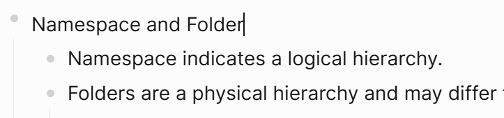

# Logseq Markdown URL Copy Plugin

In Logseq, you can copy a URL from the menu, but it's not in Markdown format.

This plugin adds a menu that generates a Markdown link to a Logseq page or block and copies it to the clipboard.

With this feature, you can easily paste links to Logseq pages or blocks into other Markdown-based tools.

## Examples

### Copy a page URL as a Markdown link

Select `Copy page URL as Markdown link` in the page menu or click the button on the page bar.

If the page name is "mypage," the copied text will be:

`[mypage](logseq://graph/_Logseq?page=mypage)`

### Copy a block URL as a Markdown link

Select `Copy block URL as Markdown link` in the block context menu or use the slash command `Copy block URL as Markdown link`.

In the case of a block, the first line is used for the link text:

`[Namespace and Folder](logseq://graph/_Logseq?block-id=696474dc-768d-4920-917c-3755670b80e5)`

