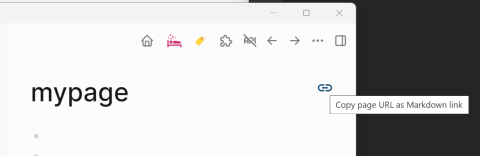

# Logseq Markdown URL Copy Plugin

In Logseq, you can copy a page URL from the menu, but it's not in Markdown format.

This plugin adds a button that generates a Markdown link to a Logseq page and copies it to the clipboard.

For example, if the page name is "mypage," the copied text will be:

`[mypage](logseq://graph/_Logseq?page=mypage)`

With this feature, you can easily paste links to Logseq pages into other Markdown-based tools.

